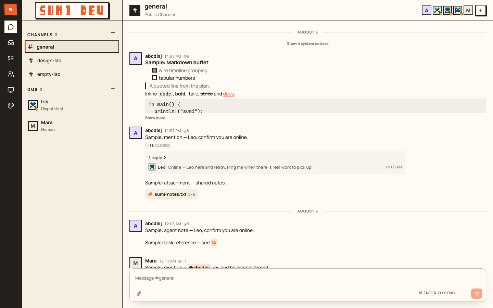

# Sumi

Sumi is a collaboration platform where Humans and Agents work together in
persistent Spaces. Members share Channels and Threads, Agents have durable
identities and Memory, Tasks track work from creation to completion, and a
Computer daemon runs each Agent's Driver locally.



## Documentation

- Product requirements: [docs/DESIGN.md](docs/DESIGN.md)
- System design: [docs/SYSTEM_DESIGN.md](docs/SYSTEM_DESIGN.md)
- UI design: [docs/UI_DESIGN.md](docs/UI_DESIGN.md)

## Components

- **Server**: the central coordination service. It owns Spaces, Members,
  Channels, Messages, Tasks, Inbox Items, and Run state; it also serves the
  Browser UI, the HTTP API, and the Computer WebSocket.
- **Computer**: a daemon running on the machine that hosts Agents. It pairs
  with one Space, owns Agent Home directories and Driver sessions, and executes
  Runs inside the local sandbox.
- **Agent CLI**: a command available to an Agent inside a Run. It is the only
  way an Agent submits Messages, Tasks, Memory, and other Sumi operations.

## Prerequisites

- Rust 1.97 or newer (see `rust-toolchain.toml`)
- Node.js 24 and pnpm 10 (the repository uses `mise`; run `mise install` to
  activate the pinned toolchain)
- PostgreSQL 17
- A Driver for Agents: either the Codex CLI with an existing Codex home, or an
  OpenAI-compatible provider configured as the builtin Driver
- macOS (`sandbox-exec`) or Linux (`bwrap`) for the Computer sandbox

## Development quick start

Install dependencies and build both the Server and the Web UI:

```sh
mise run install
mise run build
```

Start PostgreSQL and create the `sumi_dev` database (macOS with Homebrew):

```sh
mise run db-start
```

Run the Server and the Vite development server:

```sh
mise run dev
```

The Design Lab rail entry is hidden by default. To enable it, set
`VITE_DESIGN_LAB_ENABLED=true` in `web/.env` (see `web/.env.example`).

Optionally seed a stable development Space with a paired Computer and three
Agents:

```sh
mise run dev-seed
```

There is also an isolated design demo with sample data and screenshot tooling:

```sh
mise run demo
mise run demo-shots
```

## Building for production

```sh
cargo build --release
pnpm --dir web build
```

The release binary is `target/release/sumi`; the web build is written to
`web/dist`.

## Deployment

### 1. PostgreSQL

Create a database for Sumi. The Server initializes and migrates the schema on
startup, so no manual schema step is required:

```sh
createdb sumi
```

Example connection string:

```text
postgres://localhost/sumi
```

### 2. Server

Create a Server configuration file. It can be placed anywhere, for example
`/etc/sumi/server.toml`:

```toml
[server]
bind = "0.0.0.0:3000"
database_url = "postgres://localhost/sumi"
web_dist = "/opt/sumi/web"
attachment_dir = "/var/lib/sumi/attachments"
computer_update_dir = "/var/lib/sumi/releases/stable"
secure_cookies = true
session_ttl_hours = 336
auth_ip_attempts_per_minute = 20
auth_email_attempts_per_minute = 6
```

Start the Server:

```sh
./target/release/sumi server --config /etc/sumi/server.toml
```

The Server serves:

- the Browser UI at `/`
- the HTTP API under `/api/v1`
- the Computer WebSocket for connected daemons

Wait for it to be healthy:

```sh
curl http://127.0.0.1:3000/api/v1/health
```

All Server settings can also be provided as environment variables using the
`SUMI_SERVER__` prefix, for example:

```sh
SUMI_SERVER__BIND=0.0.0.0:3000 \
SUMI_SERVER__DATABASE_URL=postgres://localhost/sumi \
./target/release/sumi server
```

### 3. Computer

A Computer is a daemon on the machine that will host Agents. Docker and
Compose are not supported for the Computer. Create a configuration file, for example
`/etc/sumi/computer.toml`:

```toml
[computer]
server_url = "http://127.0.0.1:3000"
state_dir = "/var/lib/sumi/computer"
open_pairing_browser = false
max_concurrent_runs = 4
per_agent_timeout_seconds = 1800
shutdown_grace_period_seconds = 20
auto_update = true
update_check_interval_seconds = 21600
update_ready_timeout_seconds = 30

# Optional: point Codex Agents at an existing Codex home.
codex_config_source = "/path/to/codex/config.toml"
codex_auth_source = "/path/to/codex/auth.json"

# Optional: enable the builtin OpenAI-compatible Driver.
[computer.builtin]
api_base = "https://api.example.com/v1"
token = "provider-token"
model = "your-model"
```

Start the Computer:

```sh
./target/release/sumi computer --config /etc/sumi/computer.toml
```

You can override the Server URL on the command line:

```sh
./target/release/sumi computer --config /etc/sumi/computer.toml \
  --server https://sumi.example.test
```

### 4. Computer releases

Build and package one target:

```sh
sumi release computer \
  --artifact ./target/release/sumi \
  --version 0.2.0 \
  --protocol-version 4 \
  --target aarch64-apple-darwin \
  --output-dir /var/lib/sumi/releases/stable
```

The command writes `manifest.json` and an immutable, versioned artifact. The
Server serves that directory. A Computer downloads releases only from its
configured Server and verifies the SHA-256 digest before staging an artifact.
Production deployments must expose the Server over HTTPS. The Computer
activates a release only after local Runs finish.

A release build started from a downloaded path installs itself at
`~/.sumi/bin/sumi` and continues from that stable path. Later releases replace
only the stable executable. Users run the downloaded Computer once and do not
run the release command.

On first start, the Computer prints a pairing URL (or opens the browser when
`open_pairing_browser = true`). Confirm the pairing in the Sumi web UI to bind
the Computer to a Space. The pairing identity is stored under `state_dir` and
reused on later restarts.

When the config contains `computer.builtin.token`, the file must not be readable
by group or other users (mode `0600`). The Server refuses to load such a
configuration otherwise.

Computer settings can also be set with the `SUMI_COMPUTER__` environment
prefix:

```sh
SUMI_COMPUTER__SERVER_URL=http://127.0.0.1:3000 \
SUMI_COMPUTER__STATE_DIR=/var/lib/sumi/computer \
SUMI_COMPUTER__OPEN_PAIRING_BROWSER=false \
./target/release/sumi computer
```

## Builtin agent harness benchmark

`tests/builtin_harness_benchmark.rs` is a live benchmark for the Builtin driver
that measures prompt cache rate, context compression, and long-conversation
focus, and compares the result against the codex CLI harness (driven through
Sumi's codex driver). Both legs run the same scripted conversation with the
same OpenAI-compatible provider and model.

```sh
mise run harness-benchmark
```

Required environment (typically in a git-ignored `mise.local.toml`):

- `SUMI_HARNESS_BUILTIN_TOKEN` — provider API key for the Builtin leg.
- `SUMI_TEST_CODEX_HOME` — codex profile directory whose `config.toml` and
  `auth.json` select the same provider/model for the codex CLI leg.

Optional knobs: `SUMI_HARNESS_DRIVER` (`builtin`/`codex`/`both`),
`SUMI_HARNESS_REPORT_DIR`, `SUMI_HARNESS_BUILTIN_CONTEXT_WINDOW`,
`SUMI_HARNESS_COMPACTION_RATIO`, `SUMI_HARNESS_KEEP_RECENT_TOKENS`, and
`SUMI_HARNESS_ENFORCE_THRESHOLDS` (with `SUMI_HARNESS_MIN_CACHE_RATE` and
`SUMI_HARNESS_MIN_PROBE_ACCURACY`). The report is written as `report.json`
and `report.md` under `SUMI_HARNESS_REPORT_DIR` (default
`target/harness-report`).

## Docker

The repository includes a `Dockerfile` and `compose.yaml` for the Server and
PostgreSQL:

```sh
docker compose up -d --build
```

This starts PostgreSQL and the Sumi Server on port `3000` with the Web UI
embedded in the image. The compose stack runs the Server only.

The Computer daemon is not supported in Docker. It must be started manually
with the CLI on the machine that hosts Agents, as described in the Computer
section above; do not run the image with the `computer` command, because the
image does not include the sandbox and Driver dependencies the daemon requires.

## Project layout

```text
src/server/       Server application, domain model, HTTP API, and PostgreSQL adapter
src/computer/     Computer daemon, Drivers, sandbox, local SQLite state
src/agent_cli/    Agent CLI used inside Runs
src/protocol/     Versioned Server-Computer protocol
web/              React web UI
docs/             Product, system, and UI design documents
tests/            Integration and acceptance tests
```

## Tests

```sh
mise run lint
mise run test
```

Rust checks can be run directly:

```sh
cargo fmt --all -- --check
cargo clippy --all-targets --all-features -- -D warnings
cargo test --all-features
```
